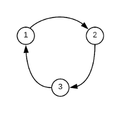

# Developer Manual

This document is directed to developers which want to build on our simulator architecture. This document does not focus on features of the simulation tool, for that look at the [User Manual](). The main purpose of this document is to describe the simulation archicture by illustrating how each component works and how does it integrate with the rest of the system. The material on this document covers most classes in following *packages*:

- *`core.routing`*
- *`core.simulator`*
- *`bgp`*

## Setup

The simulator is implemented using [Kotlin](https://kotlinlang.org/), a programming language that compiles to the JVM. Therefore, you'll need the Java Development Kit (JDK). Get [oracle's JDK](http://www.oracle.com/technetwork/java/javase/downloads/index.html) or [OpenJDK](http://openjdk.java.net/install/).

After having the JDK correctly installed, follow this steps to start developing.

1. Clone this project

        git clone  https://github.com/ssbgp/simulator
        
2. Build the project
This projects uses [Gradle](https://gradle.org/) as the build tool. Therefore, building the 
project is as simple as:

        ./gradlew build

This command will download all dependencies from the Internet, compile the project, run all 
tests, and package everything into a JAR file.

At this point you can start developing using your favourite tools. However, we do not recommend you 
to start diving directly into code. Instead, we suggest reading the next section where we explain
 most of the base architecture of the simulator. 

## Architecture

### Topology

A network topology describes the arrangement of the nodes and links in a communication network. The [Topology]() class implements an high-level abstraction of such a topology. Each topology instance holds a set of nodes and links between them.

The most important components of a topology are nodes. A node can represent any communication endpoint. Still, since this is a routing simulator, a node usually represents some kind of router able to communicate with other nodes (routers) through a common routing protocol. Nodes are implemented by the [Node]() class. This class has three properties:

1. An ID, used identify a node within a topology;
1. An instance of [Protocol](), corresponding to the routing protocol deployed by the node;
1. And a set containing all of its in-neighbors.

A neighbor is another node in the topology, with which a node is able to communicate. That node's in-neighbors are all neighbors to which it sends routing messages. Out-neighbors are all neighbors from which a node receives routing messages.

A topology is built using a [TopologyBuilder](). This class provides a set of methods to build a topology incrementally in a descriptive way. Here is an example on how to build the topology shown below.



```kotlin
val builder = TopologyBuilder<BGPRoute>()

builder.addNode(id = 1, protocol = BGP())
builder.addNode(id = 2, protocol = BGP())
builder.addNode(id = 3, protocol = BGP())

builder.link(from = 1, to = 2, extender = SomeExtender())
builder.link(from = 2, to = 3, extender = SomeExtender())
builder.link(from = 3, to = 1, extender = SomeExtender())

val topology = builder.build()
```

First we create the builder (line 1), then we add the nodes (lines 3-5), then we link each pair of nodes (lines 7-9), and finally we build the topology (line 11).

The builder ensures (1) that a topology does not include multiple nodes with the same IDs, and (2) that there are no more than one link between each pair of nodes. The following code illustrates this fact.   

```kotlin
builder.addNode(id = 1, protocol = BGP())   // OK, node 1 was not added yet
builder.addNode(id = 2, protocol = BGP())   // OK, node 2 was not added yet
builder.addNode(id = 1, protocol = BGP())   // ERROR, node 1 added twice

builder.link(from = 1, to = 2, extender = SomeExtender())       // OK
builder.link(from = 2, to = 1, extender = SomeExtender())       // OK, links are unidirectional
builder.link(from = 1, to = 2, extender = SomeOtherExtender())  // ERROR
```

To build a topology we need to specify all details of its components. For each node, we have to specify the ID and the protocol deployed by that node. In our example, each node deploys the BGP protocol. Each link is not only characterized by its tail and head nodes, but also by an extender. An extender is, essentially, a transformation function. All links are associated with an extender, which describes how routes sent by the head node are learned at the tail node. Extenders are used to model routing policies. An extender associated with a link models both the export policies of the head node and the import policies of the tail node. See the [Routing Policies](#routing-policies) section to learn more about extenders.

### Routing Protocols

Our goal was to develop a simulator to run the Border Gateway Protocol (BGP) and a variation of BGP called Self-Stable BGP (SS-BGP). All details of these protocols are implemented in the *`bgp`* package. 

The simulator was designed with flexibility in mind. Although our focus was mainly on BGP and SS-BGP, the design of the simulator provides enough flexibility to be able to support different distributed routing protocols. Since this was not our main goal, we can not ensure that all routing protocols fit with our routing model. However, there is good chance that many routing protocols could be implemented to run under our simulation architecture.

Here, we try to explain the necessary concepts to implement a routing protocol to run under this simulation architecture. We will use our implementation of BGP as an example. This section serves also as part of the documentation for our implementation of BGP.

Nodes participating in a routing protocol exchange pieces of routing information between each other, called routes, to provide connectivity to each to other. A route is composed of a set of attributes. The first step to implement a protocol is to define the attributes of its routes. A route is represented by a class, which implements the [Route]() interface. BGP routes have two attributes: the LOCAL-PREF, and the AS-PATH (BGP's specification defines other attributes, but they are not considered here). Therefore, BGP routes are implemented as follows.

```kotlin
class BGPRoute(val localPref: Int, val asPath: Path) : Route
```

This would work. Still, a complete route implementation should always override the `equals()` and `hashCode()`. Below we have the complete implementation for a BGP route.

```kotlin
class BGPRoute(val localPref: Int, val asPath: Path) : Route {

  override fun equals(other: Any?): Boolean {
        if (this === other) return true
        if (javaClass != other?.javaClass) return false

        other as BGPRoute

        if (localPref != other.localPref) return false
        if (asPath != other.asPath) return false
        return true
    }

    override fun hashCode(): Int {
        var result = localPref
        result = 31 * result + asPath.hashCode()
        return result
    }
}
```

The first step is done. Still, there are some important details to take into consideration regarding [Route]() implementations. In [Effective Java](https://www.amazon.com/exec/obidos/ASIN/0321356683/ref=nosim/javapractices-20), Joshua Bloch makes this compelling recommendation :
> Classes should be immutable unless there's a very good reason to make them mutable..."

We saw no good reason to make routes mutable. That is why we assume route instances are always immutable. Providing a Route implementation that is mutable may lead to very unexpected behavior. Therefore, strive to ensure immutability for route classes.

Having defined what a route is in the context of our routing protocol, the next step is to implement the [Protocol]() interface. This interface defines some important methods, which are supposed to be used according to the following recommendations:


```kotlin
fun setLocalRoute(node: Node<R>, route: R)
```
    
The `setLocalRoute()` method is called to set a node's local route. Each node can have a local route. This route corresponds to a route available locally to the node, which it was not learned from any of its neighbors. For BGP, the local route is usually a route learned from inside the local network. Different routing protocol may handle this route differently. In our implementation of BGP this route is considered as another candidate route, similar to any other route learned from some neighbor.

```kotlin
fun process(message: Message<R>)
```

The `process()` method is the most important method for most Protocol implementations. It is called by a node when a new routing message arrives. The [`message`]() includes the sender node and the received route. The received route corresponds to the route obtained after extending the sent route, using the extender associated with the link through which the message travelled. See [Routing Policies](#routing-policies) for more details about extenders. Protocol implementations should use this method to handle the route processing logic. 

This is more of less how the `process()` of BGP is implemented.

```kotlin
fun process(message: Message<BGPRoute>) {
  
    // Keep currently selected stored aside
    val previousSelectedRoute = routingTable.selectedRoute
    
    // Invalidate route if the AS-PATH denounces a loop
    val learnedRoute = if (node in route.asPath) BGPRoute.invalid() else message.route
    
    // Store new route in the routing table
    routingTable.update(message.sender, learnedRoute)
    
    // Read the selected route again because it may have changed due to the previous update
    val selectedRoute = routingTable.selectedRoute
    
    if (selectedRoute != previousSelectedRoute) {
        // Export a newly selected route
        node.export(selectedRoute)
    }
}
```
*We do not consider the MRAI timer here*

Notice that we do not include any code here to store or select routes. Route storage and route selection are generic processes. They are not specific to a certain routing protocol. That is why these operations were moved to their own utility classes. See [Routing Table and Route Selector](#routing-table-and-route-selector) for more details.


| Note |
|:---| 
|Remember that each node is associated with a routing protocol. Protocol implementations are supposed to have some kind of state. For this reason, each node should be assigned a different instance of a protocol implementation.|


#### Routing Table and Route Selector

The storage and selection of routes are two different processes. Thus, following the separation of responsabilities model, these two processes are implemented by two different classes. The [RoutingTable]() handles route storage and the [RouteSelector]() handles the process of selecting the best route available.

A routing table stores an entry for each neighbor. Each entry stores a candidate route and a set
of attributes. Initially the table has no entries, which means it holds no valid candidate routes. To obtain the candidate route via some neighbor, use the `get` operator. By default, if no candidate route was set for a neighbor, it returns an invalid route.

```kotlin
val routingTable = ...
val neighbor = Node(1, BGP())
val route = routingTable[neighbor]
```

To set a candidate route for some neighbor use the `set` operator.

```kotlin
val routingTable = ...
val neighbor = Node(1, BGP())

routingTable[neighbor] = BGPRoute.with(localPref = 1, asPath = emptyPath())
``` 

The selection process is delegated to the [RouteSelector]() class. The route selector uses a `compare` function to define the order among routes. The way the selector works is similar to a cache, where the goal is to avoid having to look through the routing table. It is aware of the selected route at all times. Every time the routing table is updated, the selector checks to see if the new route is better than the currently selected route. If true, then it changes the selected to the new route. Otherwise, it checks if the new route was set for the currently selected neighbor. If true, then it is has to go through all routes in the routing table to select the best one. Otherwise, it keeps the current route. The code use is more or less equal to the following.

```kotlin
fun update(neighbor: Node<R>, route: R) {
    // Update routing table
    table[neighbor] = route

    if (compare(route, selectedRoute) > 0) {
        selectedRoute = route
        selectedNeighbor = neighbor
    } else if (neighbor == selectedNeighbor && compare(route, selectedRoute) != 0) {
        reselect()
    } else {
        // Keep current route
    }
}
```

The `compare` function takes two routes and returns an integer value to indicate their order:

   - a positive integer value indicates the left route has an higher preference than the one on the right
   - a zero indicates the two routes have the exact same preference
   - a negative integer value indicates the left route has a lower preference than the one the right
   

BGP routes are compared using their attributes. The first attribute to be evaluated is the LOCAL-PREF. A route with an higher LOCAL-PREF is preferred to another with a lower value. If the LOCAL-PREFs of the two routes are equal, then the length of the AS-PATH is used to break the tie. Routes with shorter AS-PATH are preferred to route with a longer one. If the lengths also match, then best route is the one the next-hop of which has the lowest ID. Here is an example of that code.

```kotlin
fun bgpRouteCompare(route1: BGPRoute, route2: BGPRoute): Int {

    var difference = route1.localPref.compareTo(route2.localPref)
    if (difference == 0) {
        difference = route2.asPath.size.compareTo(route1.asPath.size)
        if (difference == 0) {
            val nextHop1 = route1.asPath.nextHop() ?: return 0
            
            difference = nextHop2.id.compareTo(nextHop1.id)
        }
    }

    return difference
}
```

#### Routing Policies

Routing policies describe which routes are exported and what preference do nodes assign to each route they import. They are modeled exclusively by extenders. An extender is a transformation function, that takes a route and outputs a new route obtained from the input route. Each link in a topology is assigned an extender. The extender of link *uv* models the export policies of *v*, relating to *u*, and the import policies of *u*, relating to *v*. In other words, the extender describes how routes sent from *v* to *v* are learned at *u*.

The extender of a link is called every time a new route is sent to a neighbor. The route carried in the messages correponds to the route obtained after extending the sent route. 

Next we show two examples of how to implement routing policies using extenders for example case of BGP.

###### Example of short-path routing under BGP

The shortest-path routing policies under BGP consider that each link has a length given by some integer value. Since BGP prefers routes with an higher LOCAL-PREF, the LOCAL-PREF of a route learned under these policies is given by the symmetric of the sum over the lengths of each link traversed by the route. Therefore, for a link *`uv`* with length *`l`*, a route *`(c, P)`* sent by *`v`* is learned at *`u`* with LOCAL-PREF given by *c - l*.

Here is how we implement this using the Extender interface.

```kotlin
class ShortestPathExtender(val length: Int) : Extender<BGPRoute> {

    override fun extend(route: BGPRoute, sender: Node<BGPRoute>): BGPRoute {
        return when {
            !route.isValid() -> BGPRoute.invalid()
            else             -> BGPRoute.with(localPref = route.localPref + length, asPath = route.asPath.append(sender))
        }
    }

}
```
Notice the AS-PATH of the output route corresponds to the AS-PATH of the original route with the sender appended to it. By default, BGP adds the sending node to the AS-PATH. Therefore, we could have hard-coded to the protocol the action of appending the sending node to the AS-PATH. However, in real networks it is possible to do something different. Nodes may intentionally or unintentionally forget to include the sending node in the AS-PATH. Having the extenders model the transformation of both the LOCAL-PREF and the AS-PATH provides us with the flexibility to run simulations where all or some nodes violate the original specification.

###### Example of interdomain routing under BGP

The interdomain routing policies described here refer to the baseline GR routing policies defined [here](https://www.cs.princeton.edu/~jrex/papers/sigmetrics00.long.pdf). These policies define two possible relationships: customer-provider, and peer-peer. Each node can have three different relationships with a neighbor: it may be a customer, a provider, or a peer. This corresponds to having three different extenders, one for each relationship.

```kotlin
object CustomerExtender: Extender<BGPRoute>
object PeerExtender: Extender<BGPRoute>
object ProviderExtender: Extender<BGPRoute>
```

These policies assume all routes received at a node are imported. A route learned from a customer (peer, provider) link is called a customer (peer, provider) route. Each type of route is assigned a different LOCAL-PREF. Customer routes are preferred to peer routes and the latter are preferred to provider routes. Therefore, the LOCAL-PREF assigned to customer routes is higher than the one assigned to peer routes and the same is true for peer and provider routes. We will use the values below.

- Customer route - 300
- Peer route - 200
- Provider route - 100

The export policies are simple: customer routes are exported to every neighbor, while peer and provider routes are only exported to customers (through provider links).

In code, this corresponds to the following.

```kotlin
object CustomerExtender: Extender<BGPRoute> {
    override fun extend(route: BGPRoute, sender: Node<BGPRoute>): BGPRoute {
        return when {
            !route.isValid()      -> BGPRoute.invalid()
            route.localPref < 300 -> BGPRoute.invalid()
            else                  -> BGPRoute.with(localPref = 300, asPath = route.asPath.append(sender))
        }
    }
}

object PeerExtender: Extender<BGPRoute> {
    override fun extend(route: BGPRoute, sender: Node<BGPRoute>): BGPRoute {
        return when {
            !route.isValid()      -> BGPRoute.invalid()
            route.localPref < 300 -> BGPRoute.invalid()
            else                  -> BGPRoute.with(localPref = 200, asPath = route.asPath.append(sender))
        }
    }
}

object ProviderExtender: Extender<BGPRoute> {
    override fun extend(route: BGPRoute, sender: Node<BGPRoute>): BGPRoute {
        return when {
            !route.isValid()      -> BGPRoute.invalid()
            else                  -> BGPRoute.with(localPref = 100, asPath = route.asPath.append(sender))
        }
    }
}
```

### Event-driven Simulation

The simulator is driven by events. An event can be anything: a routing message that arrived at node, a timer that expired, etc. Ultimately, an event triggers some action at a certain moment in time. Events are kept in a scheduler. This scheduler is implemented has a priority queue that uses the events' occurrence time as the priority key. Events with the lowest occurrence time are kept at the head of the queue. The simulator runs a loop. In each iteration of the loop, it takes the next event from the scheduler (the one with the lowest occurrence time) and processes that event. While processing an event, more events may be added to the scheduler. When the scheduler has no more events to process, the simulator exists the loop and the simulation ends.
   
A simulation is initiated by adding some events to the scheduler and, then, running the event loop. The way events are usually added to the scheduler is by calling the `advertise()` method on one or more nodes from the simulated topology. This will trigger the `setLocalRoute()` method of the protocols deployed by those nodes. Usually, this should generate new events. However, this is completely dependent on the protocol implementation. For the case of BGP (and similar protocols), setting the local route of a node is equivalent to have that node originate a route for some destination and propagate it to its neighbors. Setting the local route for a single node is equivalent to simulating the advertisement of a destination in unicast. To simulate an anycast scenario, the only thing we have to do is set the local route for more than one node. 

Events are any class that implements the [Event]() interface. The simulator already includes the two most basic events, but more events can be included to add different functionality. We will see that later on. The most common event is the [MessageEvent](). As the name might suggest, this event is related to the routing messages exchanged between nodes during the simulation. A message event is scheduled when a node sends a message and it occurs at the time the message arrives at the recipient node. The occurrence of a message event triggers the recipient's `receive()` method, which later triggers the `process()` method of the protocol deployed by that node. During this process, new events may be added to the simulation scheduler. For instance, BGP schedules new message events every time it selects a new route and wants to send it to neighbors.

Messages are sent through a [Connection](), which abstracts a real unidirectional TCP like connection, where messages are surely delivered to the recipient in a first-in-first-out order (messages are not lost). Moreover, a connection also emulates the routing delays found on real networks by subjecting each message to a delay taken from [DelayGenerator](). The simulator already includes two delay generator implementations: [NoDelayGenerator]() and [RandomDelayGenerator](). The first is a dummy generator which introduces no delays to routing messages. Concretely, it always generates delay values of 0. The [RandomDelayGenerator]() uses a random uniform distribution to generate delay values within a specified interval.

Another very important event is the [AdvertiseEvent](). Each advertise event is associated with a node *`n`* and route *`r`*. When such an event occurs, the `advertise()` method of *`n`* is called with *`r`* as the local route. As mentioned before, simulations are initiated by calling that method for some of the nodes in the topology. Therefore, advertise events can be used to initialize simulations. Furthermore, since they are events, we can use them to set local routes for different nodes at different times. For BGP, this would mean having different routes being originated at different nodes at different times. Advertise events are, usually, scheduled before the simulation loop starts.


##### Example of a custom event: Timer

The functionality of the simulator can be expanded through events. The [Timer]() utility class is one example of that. The [Timer]() class implements a timer for the simulator. Each timer is associated with an *`action`*, which is executed when the timer expires. This class is used to implement the MRAI timer used by the BGP protocol.

The way the [Timer]() class works is simple. When a timer is created, it schedules a [TimerExpiredEvent]() to occur *`x`* units of time after the current simulation time, where *`x`* corresponds to the duration of the timer. When the event expires, it triggers the timer's *`action`*.

### Notification system

During the execution of a simulation the simulator issues notifications that can be captured by special classes called notification listeners. Notifications are a powerful feature, because they provide a mechanism to interact with the simulation dynamically without having to modify the simulation logic.

Originally, the simulator provides the following notifications:

- [StartNotification]() - Issued before the simulation starts
- [EndNotification]() - Issued after the simulation ends
- [ThresholdReachedNotification]() - Issued when the simulation threshold is reached before the simulation ended
- [MessageSentNotification]() - Issued every time a new message is sent by a node
- [MessageReceivedNotification]() - Issued every time a new message arrives at a node

To better understand how notifications can be used to interact with the simulation, we're going to implement a notification listener, which counts the total number of messages sent during the simulation. Since we want to count the number of sent messages, we will want to listen to [MessageSentNotification]()s. Therefore, we need to implement the [MessageSentListener]().

```Kotlin
class CountMessages : MessageSentListener {
    val messageSentCount = 0
    
    override fun onMessageSent(notification: MessageSentNotification) {
        messageSentCount++
    }
}
```

The `onMessageSent()` method is called every time a MessageSentNotification is issued. Thus, we only need to keep incrementing the `messageSentCount` counter every time `onMessageSent()`. When the simulation ends, that counter holds the total number of messages sent during the simulation.

Notifications not only indicate that some event occurred. They also include the time at which that event occurred and information relevant to the context where they are issued. For instance, a [StartNotification]() includes the seed used for the delay generator and the topology under simulation. While a [MessageSentNotification]() carries the sent message which triggered the notification. To illustrate this, we will expand our previous example by having it print the route carried by each message.

```Kotlin
class CountMessages : MessageSentListener {
    val messageSentCount = 0
    
    override fun onMessageSent(notification: MessageSentNotification) {
        messageSentCount++
        print(notification.route)
    }
}
```

Notifications are issued by the [Notifier](). For our listener to receive notifications it needs to register itself with this notifier. This is done using the notifier's `add` method. 

```Kotlin
Notifier.addMessageSentListener(this)
```

To have our listener stop receiving notifications, use the corresponding `remove` method.

```Kotlin
Notifier.removeMessageSentListener(this)
```

We have seen that notification are very useful to track the progress of a simulation and for collecting data. Although we will not discuss that here, they can also be used to modify the behavior of the simulation dynamically. Nevertheless, notifications become even more interesting when routing protocols issue their own notifications. Protocol notifications provide valuable insight about their operation. We will explain briefly how this can be accomplished, using our implementation of BGP as an example.

1. The first thing to do is defining the set of notifications that we want our protocol to issue. In the case of BGP, we decided to issue the following notifications.

    - [LearnNotification]() - Issued when a node exports a route
    - [SelectNotification]() - Issued when a node selects a new route
    - [ExportNotification]() - Issued when a node exports a route
    
    Here is the code for the notification classes.
    
    ```kotlin
    data class LearnNotification(
            val node: Node<BGPRoute>,       // node that learned the route
            val route: BGPRoute,            // route learned
            val neighbor: Node<BGPRoute>    // neighbor from which route was learned
    ) : Notification()
    
    data class SelectNotification(
            val node: Node<BGPRoute>,       // node that selected the route
            val selectedRoute: BGPRoute,    // newly selected route
            val previousRoute: BGPRoute     // route previously selected
    ) : Notification()
    
    data class ExportNotification(
            val node: Node<BGPRoute>,       // node that exported the route
            val route: BGPRoute             // exported route
    ) : Notification()
    
    ```

2. Then, we create one listener for each notification. Notice that each interface extends the [NotificationListener]() interface.

    ```kotlin
    interface LearnListener : NotificationListener {
        fun onLearn(notification: LearnNotification)   // called when learn notification is issued
    }
 
    interface SelectListener : NotificationListener {
        fun onSelect(notification: SelectNotification) // called when select notification is issued
    }
 
    interface ExportListener : NotificationListener {
        fun onExport(notification: ExportNotification) // called when export notification is issued
    }
    ```
    
3. With both this things done, we have to create a new notifier. To do this, we copy and paste the original [Notifier]() and adjust its implementation for the our new notifications.

    ```kotlin
    object BGPNotifier{
       // Lists containing the registered listeners
       private val learnListeners = mutableListOf<LearnListener>()
       private val selectListeners = mutableListOf<SelectListener>()
       private val exportListeners = mutableListOf<ExportListener>()
       
       // Learn notifications
       fun addLearnListener(listener: LearnListener) {
           learnListeners.add(listener)
       }
       fun removeLearnListener(listener: LearnListener) {
           learnListeners.remove(listener)
       }
       fun notify(notification: LearnNotification) {
           learnListeners.forEach { it.onLearn(notification) }
       }
       
       // Select notifications
       fun addSelectListener(listener: SelectListener) {
           selectListeners.add(listener)
       }
       fun removeSelectListener(listener: SelectListener) {
           selectListeners.remove(listener)
       }
       fun notify(notification: SelectNotification) {
           selectListeners.forEach { it.onSelect(notification) }
       }
       
       // Export notifications
       fun addExportListener(listener: ExportListener) {
           exportListeners.add(listener)
       }
       fun removeExportListener(listener: ExportListener) {
           exportListeners.remove(listener)
       }
       fun notify(notification: ExportNotification) {
           exportListeners.forEach { it.onExport(notification) }
       }
    }
    ```
    
And we are done. We can now use our new notifications to learn about our routing protocol. 

#### Use cases for notifications

###### Output simulation events

Showing a trace of each event occurring in our simulation is straight forward with notifications.

```kotlin
class TraceBGP: LearnListener, SelectListener, ExportListener {

    override fun onLearn(notification: LearnNotification) {
        print("At ${notification.time}: node ${notification.node} learned route ${notification.route}")
    }
    
    override fun onSelect(notification: SelectNotification) {
        print("At ${notification.time}: node ${notification.node} selected route ${notification.selectedRoute}")
    }
        
    override fun onExport(notification: ExportNotification) {
        print("At ${notification.time}: node ${notification.node} exported route ${notification.route}")
    }

}
```

###### Measure the termination times of each node

The termination time of a node is given by the time at which the last event of the node occurred. Since processing a route is an atomic operation this time corresponds to the last time a node learned or exported a route. Thus, all we have to do is keep track of the times each node learned and/or exported a route. This can be done easily by listening to learn and export notifications. For this example, we ignore select notifications.

```kotlin
class MeasureTerminationTimes: LearnListener, ExportListener {
    val terminationTimes = HashMap<Node<BGPRoute>, Int>()
    
    override fun onLearn(notification: LearnNotification) {
        terminationTimes[notification.node] = notitification.time
    }
        
    override fun onExport(notification: ExportNotification) {
        terminationTimes[notification.node] = notitification.time
    }
}
```

When the simulation ends, `terminationTimes` will hold the termination time of each node.

